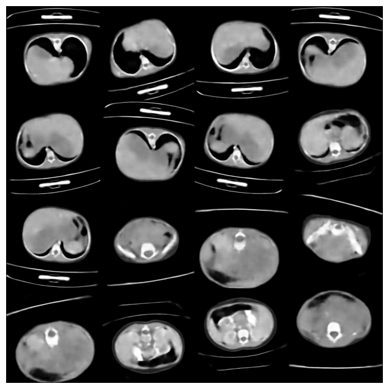

# Kidney Tumor Classification using Data Distribution Extracted by VAE



## 🧠 Project Overview

This project focuses on classifying pediatric kidney tumors using magnetic resonance imaging (MRI). Due to limited data availability, a **Variational Autoencoder (VAE)** was employed to learn the underlying distribution of the dataset. Classification was then performed on the latent representations using various models.

## 🚀 Approach

1. **Data Preprocessing**
   - MRI scans of pediatric kidneys were collected and preprocessed.
   - The dataset was limited in size and class imbalance was present.

2. **Representation Learning**
   - A **VAE** was trained to capture the distribution of the data.
   - The learned latent space served as a compressed, informative feature space.

3. **Classification**
   - The latent vectors were used to train and evaluate the following classifiers:
     - 🧠 Support Vector Machine (SVM)
     - 🔗 Multilayer Perceptron (MLP)
     - 🌀 Convolutional Neural Network (CNN)
     - ✨ Transformer-based classifier

## ⚡ Benefits

- Enables high classification accuracy despite small dataset size.
- Training classifiers on latent space is extremely fast and efficient.
- Models converge quickly due to reduced feature dimensionality.

## 📊 Results

| Model       | Accuracy | F1 Score |
|-------------|----------|----------|
| CNN         | **99.2%** | **99.2%** |
| Transformer | **97.12%** | **96.83%**     |
| MLP         | **97.73%** | **99.71%** |
| SVM         | **80.30%** | **80.34%** |

> **Note**: CNN yielded the best performance while being lightweight and very fast to train on the VAE’s latent space.

## 🖼️ Dataset Example

Include a representative image or a montage of MRI samples here:
```bash

